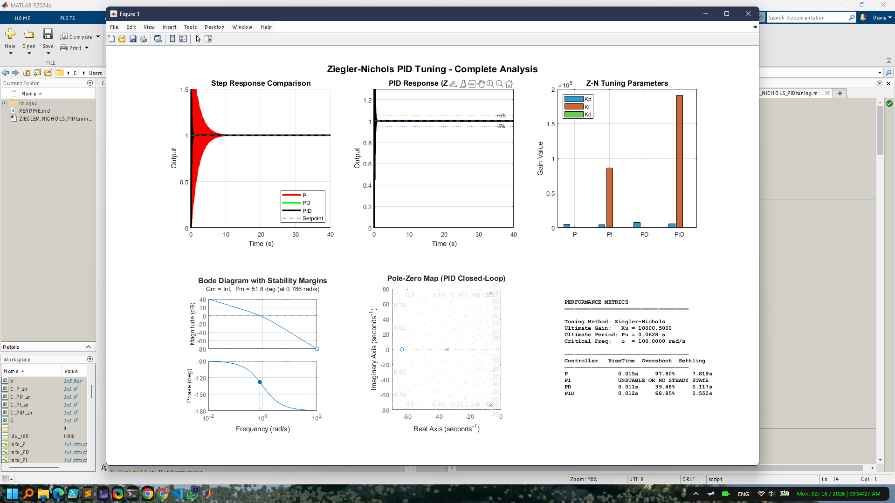

#  Ziegler-Nichols PID Tuning Demo (MATLAB)

Welcome to the **Ziegler-Nichols PID Tuning** project! This interactive MATLAB demo showcases the classic Ziegler-Nichols frequency response method for tuning PID controllers, with clear visualizations and performance analysis.

---

## What Does This Project Do?

- **Automatically tunes** P, PI, PD, and PID controllers for a second-order plant with an integrator
- **Visualizes** step responses, tuning parameters, Bode plots, and more
- **Compares** controller performance (rise time, overshoot, settling time, etc.)
- **Guides you** through the Ziegler-Nichols frequency response method step by step

---

## Demonstration

### MATLAB Code Overview

<em>Figure 1:</em> The main script, showing the plant definition, Ziegler-Nichols calculations, and simulation setup. The code guides you through each step, from finding the ultimate gain and period to simulating and analyzing controller performance.

### Resultant Graphs & Analysis

<em>Figure 2:</em> Example output after running the script. The results include:
<ul>
<li>Step response comparison for P, PI, PD, and PID controllers</li>
<li>PID response detail with ±5% bounds</li>
<li>Bar chart of Z-N tuning parameters (Kp, Ki, Kd)</li>
<li>Bode plot with stability margins</li>
<li>Pole-zero map for the PID closed-loop system</li>
<li>Performance metrics table (rise time, overshoot, settling time, etc.)</li>
</ul>

---

## How to Run
1. Open `ZIEGLER_NICHOLS_PIDtuning.m` in MATLAB.
2. Run the script. All results and plots will be generated automatically.

---

## Methodology
This demo uses the **Ziegler-Nichols frequency response method**:
1. **Find the ultimate gain (Ku) and period (Pu)** by analyzing the plant’s frequency response.
2. **Calculate controller parameters** for P, PI, PD, and PID using Z-N formulas.
3. **Simulate and compare** the closed-loop step responses.
4. **Visualize** all results for easy comparison and learning.

---

## Why is this Cool?
- **All-in-one visualization:** See every key result at a glance.
- **Educational:** Great for students and engineers learning PID tuning.
- **Automatic analysis:** No manual calculations needed!

---

## Notes
- The plant is: $G(s) = \frac{1}{s(s+1)}$
- **PD controllers** are unstable for this plant (with integrator).
- **PI and PID controllers** provide good steady-state tracking.
- The script prints detailed performance metrics and recommendations in the MATLAB console.

---

## Try it Yourself!
Clone or download this repo, open the script in MATLAB, and start tuning!

---

> Made with ❤️ for control engineering enthusiasts.
